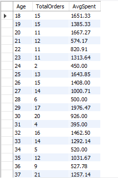

# E-commerce Sales Analysis Hackathon
### By Juanita Chepchumba

## 📌 Overview
This project is part of a data analysis hackathon, focusing on uncovering insights from an e-commerce dataset. The analysis involves SQL queries, Python scripting, and Power BI visualization to answer key business questions regarding sales trends, customer behavior, and order fulfillment.

---
## 🔍 Hackathon Questions
The analysis is guided by the following questions:

### **Sales Analysis**
1. What are the total sales by region?
2. Which product category generates the highest revenue?
3. What is the average shipping fee by region?

### **Customer Behavior**
1. How does customer age impact purchasing behavior?
2. What is the most popular product by gender?

### **Order Fulfillment**
1. What is the order fulfillment rate (delivered vs. returned)?
2. Are there any trends in shipping status over time?

---
## 📊 Data Cleaning Process
Before conducting the analysis, the dataset underwent cleaning, including:
- Handling missing values
- Removing duplicate records
- Converting data types
- Standardizing categorical variables

---
## 🗃 SQL Analysis
### **Total Sales by Region**

### **Which Product Category Generates the Highest Revenue?**

### **Average Shipping Fee by Region**

### **Customer Age and Purchasing Behavior**
  

### **Most Popular Product by Gender**

### **Order Fulfillment Rate**

---
## 🐍 Python Analysis
### **Installing Required Dependencies and Connecting to the Database**
The Python scripts used for analysis are located in the `Files/Python_Analysis_Scripts.ipynb` file.

### **Data Cleaning and Preprocessing**
- Handling missing data
- Formatting dates
- Removing inconsistencies

### **Exploratory Data Analysis (EDA)**
#### **Total Sales by Category**

#### **Sales Trend Over Time**

#### **Gender-Based Spending Trends**

#### **Best-Selling Products**

#### **Monthly Sales Trends**

#### **Revenue by Region**

#### **Order Delivery Status**

---
## 📊 Power BI Dashboard
The Power BI dashboard provides an interactive visualization of key metrics. The `.pbix` file can be found in the repository under `Files/PowerBI_Analysis_Dashboard.pbix`.

---
## 🎯 Conclusion
The analysis uncovered key business insights:
- The **highest sales** come from the `North` and `East` regions.
- `Electronics` is the **best-selling category**, generating the highest revenue.
- **Older age groups (45-54, 55-64)** contribute more to total sales.
- `Laptops` dominate as the most purchased product.
- **Shipping delays** are observed in certain regions, requiring logistical improvements.

This analysis provides valuable insights for optimizing sales strategies and improving operational efficiency. 🚀

