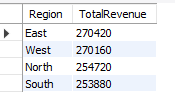
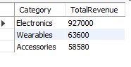
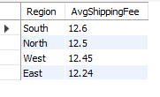
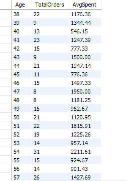
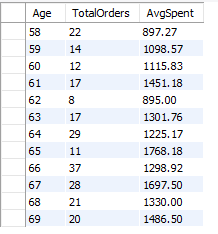
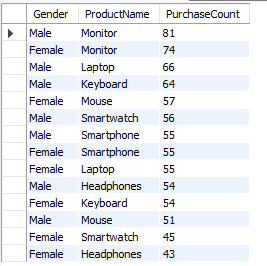
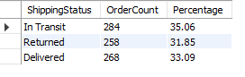

# -E-commerce-Sales-Analysis-Hackathon
By Juanita Chepchumba
## Hackathon Questions 
Use the following questions to guide your analysis. 
### Sales Analysis 
1. What are the total sales by region? 
2. Which product category generates the highest revenue? 
3. What is the average shipping fee by region? 
### Customer Behaviour 
1. How does customer age impact purchasing behavior? 
2. What is the most popular product by gender? 
### Order Fulfillment 
1. What is the order fulfillment rate (delivered vs. returned)? 
2. Are there any trends in shipping status over time?

## Introduction
## Data Cleaning Process
## SQL Analysis
What are the total sales by region? 

Which product category generates the highest revenue?  

What is the average shipping fee by region?  

How does customer age impact purchasing behavior?  

  

What is the most popular product by gender?  

What is the order fulfillment rate (delivered vs. returned)? 

## Python Analysis
## Power BI Dashboard
## Conclusion
