# E-Commerce Sales Analysis Hackathon
BY JUANITA CHEPHCUMBA
## 🏆 Project Overview
This project is part of the **E-Commerce Sales Analysis Hackathon**, where the goal is to analyze sales data to uncover valuable insights on customer behavior, sales trends, and order fulfillment efficiency. The analysis is conducted using **SQL, Python, and Power BI**.

---

## 🔎 Hackathon Questions
The analysis is guided by the following key questions:

### **Sales Analysis**
1️⃣ What are the **total sales by region**?
2️⃣ Which **product category** generates the highest revenue?
3️⃣ What is the **average shipping fee** by region?

### **Customer Behavior**
4️⃣ How does **customer age** impact purchasing behavior?
5️⃣ What is the **most popular product by gender**?

### **Order Fulfillment**
6️⃣ What is the **order fulfillment rate** (delivered vs. returned)?
7️⃣ Are there **trends in shipping status over time**?

---

## 📂 Project Structure
- **Files/** → Contains SQL, Python, and Power BI analysis files.
  - `SQL_Analysis_Queries.sql` → SQL queries for sales insights.
  - `Python_Analysis_Scripts.ipynb` → Python scripts for data processing.
  - `PowerBI_Analysis_Dashboard.pbix` → Power BI dashboard file.
- **img/** → Contains visualization screenshots.
- **sales_data.csv** → The dataset used for analysis.
- **README.md** → This documentation file.

---

## 📊 Data Analysis Process

### **1️⃣ Data Cleaning Process**
- Removed missing values and duplicates.
- Standardized data types.
- Converted `OrderDate` into a datetime format.

### **2️⃣ SQL Analysis**
Performed SQL queries to extract insights:

#### ✅ Total Sales by Region

#### ✅ Highest Revenue-Generating Category

#### ✅ Average Shipping Fee by Region

#### ✅ Customer Age vs. Purchasing Behavior
  

#### ✅ Most Popular Product by Gender

#### ✅ Order Fulfillment Rate

---

## 🐍 Python Analysis

### **1️⃣ Installing Dependencies & Connecting to the Database**
The Python analysis was performed using **Pandas and SQLAlchemy** to process sales data.

### **2️⃣ Data Cleaning & Preprocessing**
- Handled missing values and duplicates.
- Transformed data into structured formats for analysis.

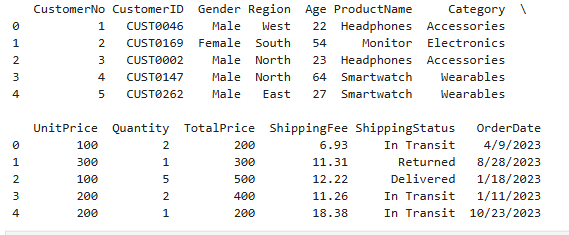 
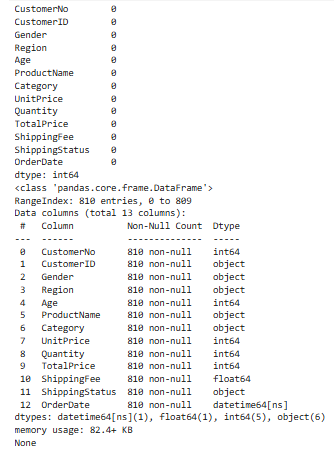

### **3️⃣ Exploratory Data Analysis (EDA)**
- **Total Sales by Category** → Analyzed revenue per product type. 
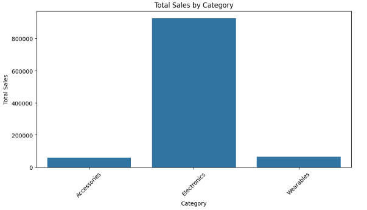 

- **Daily Sales Trends Over Time** → Identified peak shopping months. 
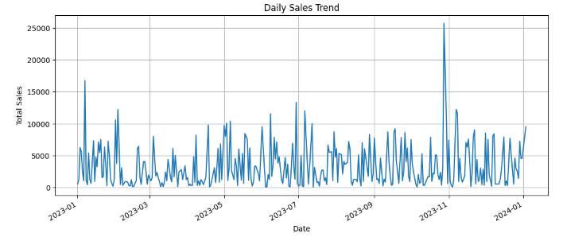 

**Monthly Sales Trends Over Time** → Identified peak shopping months. 
 

- **Customer Spending Trends** → Gender-based and region-based analysis. 
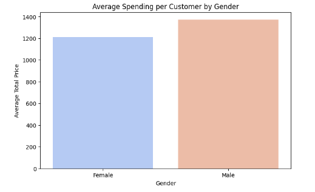 
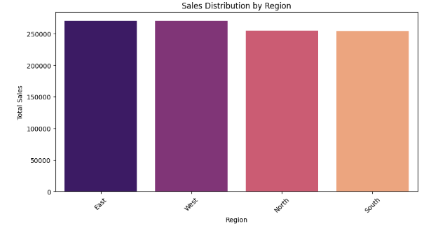 

- **Order Delivery Status** → Analyzed delivery success rates. 
 

- **Python dashboard** 
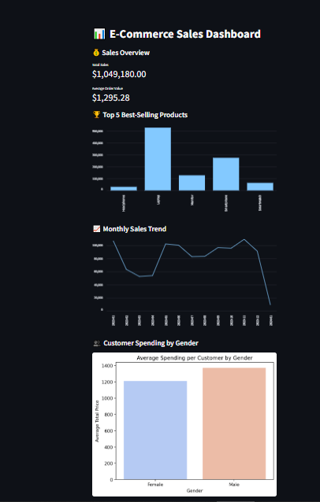 

---

## 📈 Power BI Dashboard
# Power BI Analysis for E-Commerce Sales

## 📊 Overview
This document outlines the process of building a Power BI dashboard for the **E-Commerce Sales Analysis Hackathon**. The dashboard visualizes key insights from the dataset, including **sales trends, customer behavior, and order fulfillment metrics**.

---

## 🎯 Objectives
- Identify **top-selling products and high-revenue categories**.
- Analyze **sales trends over time** to determine peak shopping periods.
- Assess **customer demographics (gender, age, region) and their impact on purchasing behavior**.
- Evaluate the **order fulfillment rate** (delivered vs. returned orders).

---

## 📂 Dataset Used
- **File Name:** `sales_data.csv`
- **Key Columns:**
  - `CustomeNo`, `CustomerID`, `Gender`, `Age`, `Region`
  - `ProductName`, `Category`, `UnitPrice`, `Quantity`, `TotalPrice`
  - `ShippingStatus`, `OrderDate`

---

## 🛠️ Steps to Build the Dashboard

### **1️⃣ Data Import & Preparation**
- Imported `sales_data.csv` into Power BI.
- Checked data types and ensured correct formatting.
- Transformed `OrderDate` into **Date/Time format** for time-based analysis.
- Removed duplicate entries and handled missing values.

### **2️⃣ Data Cleaning & Transformation**
- Created **calculated columns**:
  - `TotalRevenue = UnitPrice * Quantity`
  - `AverageShippingFee = AVERAGE(ShippingFee)`
- Used **DAX (Data Analysis Expressions)** to compute revenue by category and region.

### **3️⃣ Creating Visualizations**
✅ **Total Sales Overview** → KPI Card displaying total sales. 
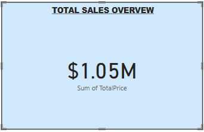

✅ **Sales by Region** → Donut Chart showing revenue per region. 
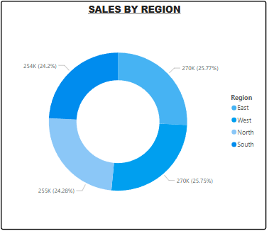

✅ **Sales by Category** → Pie Chart comparing delivered vs. returned orders. 
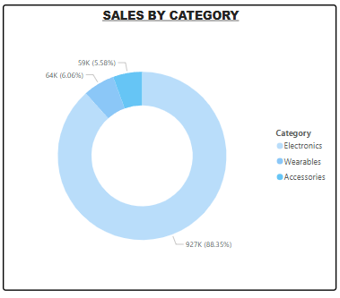

✅ **Top-Selling Products** → Bar Chart ranking best-selling products. 
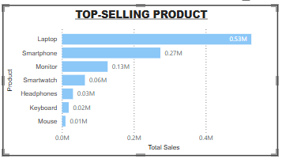

✅ **Sales Trend Over Time** → Line Chart tracking revenue over months. 
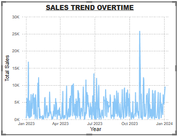

✅ **Customer Demographics** → Gender-based & Age-based spending analysis. 
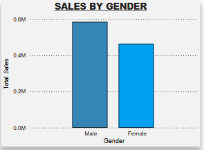  
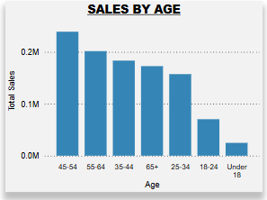

---

**DASHBOARD**

---

## 📌 Business Insights & Recommendations
📌 **Laptops & Smartphones** generate the highest revenue. Focus marketing efforts on these products.
📌 **North & East regions** drive the most sales. Consider expanding services in these areas.
📌 **Customers aged 45-54** spend the most. Personalized marketing can increase sales.
📌 **5% of orders are returned**, indicating potential issues with product quality or delivery service.

---

## 🎯 Conclusion
This analysis provides valuable insights into customer purchasing patterns, sales trends, and operational efficiency. These findings can be leveraged for **business decision-making, marketing strategies, and supply chain improvements**.

